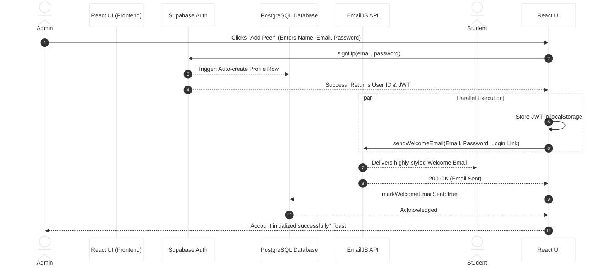

# InternTrack System Architecture and Data Flow

This document provides a detailed breakdown of how InternTrack operates under the hood, from authentication tokens to database triggers.

---

## 1. Authentication Flow (Users & Admins)

InternTrack uses **Supabase Auth**, which relies on secure JSON Web Tokens (JWT) to manage sessions.

### How it Works:
1. **Signup / Login Trigger**: When a user enters their credentials, the React frontend (`AuthForm.tsx`) sends a request to the Supabase Auth server.
2. **JWT Generation**: If credentials are valid, Supabase generates an encrypted JWT session token.
3. **Token Storage**: 
   - We explicitly configured the app to use the **`implicit`** flow.
   - The token is securely stored in the browser's **`localStorage`** under the key `internship-auth-token`.
   - *Why?* This ensures that when the user hard-refreshes the page, the app immediately reads the token from local storage synchronously.
4. **Admin vs. User**:
   - Both Admins and Students use the exact same token storage mechanism. 
   - The difference lies in the **Database Role**. Admin accounts (or the specific `admin@gmail.com`) are flagged with `role: 'admin'` in the `profiles` table.
   - When the React app loads, it reads the profile. If the role is `admin`, it unlocks the Global Analytics, System Console, and User Registry tabs.

---

## 2. Automated Email Onboarding Logic

When a new user is created—either by signing themselves up or an Admin manually adding a peer—an automatic email is dispatched.

### The Flow:
1. **Frontend Trigger (`App.tsx` or `UserRegistryView.tsx`)**:
   - Once Supabase confirms the account is created, the frontend calls the `sendWelcomeEmail(userId, email, name, password)` function.
2. **Third-Party Relay (EmailJS)**:
   - InternTrack doesn't require a dedicated Node.js backend server to send emails. Instead, it securely communicates with the **EmailJS** API directly from the frontend using encrypted environment variables.
   - The payload includes a direct **Login Link** (`https://internship-0sf2.onrender.com/`) so the user can instantly access the portal.
   - If an Admin creates the account, the temporary *plain-text password* is also securely injected into the email payload.
3. **Database Confirmation (`supabase.ts`)**:
   - Once EmailJS responds with a `200 OK` status, the frontend fires a quick database update: `markWelcomeEmailSent(userId)`.
   - This flips a boolean in the `profiles` SQL table so the Admin dashboard knows the user successfully received their onboarding package.

---

## 3. Database Architecture & Security (Backend)

InternTrack runs on a robust **PostgreSQL** database hosted via Supabase.

### Row Level Security (RLS)
Security is handled at the database level, not just the frontend. 
- When a student requests `getApplications()`, the backend checks their JWT token.
- **RLS Policy**: The database physically prevents a user from seeing rows where `user_id` does not match their JWT ID. 
- *Result:* Students can never hack the frontend to see another student's applications.

### Automated Triggers
- When a user signs up via Auth, a **Postgres Trigger** automatically intercepts this event and creates a matching row in the public `profiles` table. This prevents "orphan" accounts that have a login but no user profile data (like University or Major).

### Singleton Client Handling
- To prevent Vite hot-reload crashes, the `supabase` client is initialized as a **Singleton** on the `globalThis` object. It ensures that 100% of network requests route through a single, perfectly authenticated pipeline.

---

## 4. Visual Sequence Diagram

Here is a visual map of the System Flow when an Admin creates a new user:

