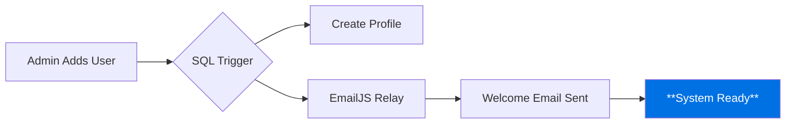
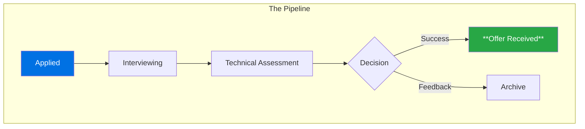

# 🚀 InternTrack: Executive Technical Briefing

> **Prepared by:** AI Expert & HR Management  
> **Status:** High-Level Presentation Ready  
> **Theme:** Enterprise Efficiency & Security

---

## 💎 Project Vision: The "Command Center"
InternTrack is not just a tracker; it is an **Autonomous Internship Ecosystem**. We have built a system that feels like a premium "Command Center" for both students and administrators.

---

## 🛠️ The "A-Z" Tech Stack (Simplified)

| Layer | Technology | **Why it Matters?** |
| :--- | :--- | :--- |
| **Frontend** | **React 19 + Vite 7** | **Hyper-fast** interface with zero lag. |
| **Styling** | **Tailwind CSS + Framer** | **Premium animations** and "Glassmorphism" design. |
| **Database** | **PostgreSQL (Supabase)** | **Rock-solid** data integrity for all students. |
| **Security** | **Row-Level Security (RLS)** | Ensures **student data is invisible** to others. |
| **Emails** | **EmailJS** | **Automated onboarding** without needing a heavy backend. |

---

## 🧠 Core System Logic (The "Brain")

### 1. The Automated Onboarding Flow
We eliminated manual setup. The second an admin adds a user, the system triggers a chain reaction:

### 2. Data Isolation & Security (RLS)
Unlike basic apps, InternTrack uses **Database-Level Security**. If a hacker tries to access data via the API, the database itself says "No" because it checks the **JWT Token** against the owner of the record.

---

## 📊 Project Funnel (Pipeline Logic)
The system tracks applications through a structured funnel, ensuring no opportunity is lost.

---

## ⚡ presentation Commands
**Run these to WOW the client:**

1.  **Launch Dashboard:** `npm run dev`  
    *(Shows the live, interactive app)*
2.  **Optimize System:** `npm run build`  
    *(Prepares the app for global deployment)*
3.  **Check Integrity:** `npm run lint`  
    *(Verifies zero code errors)*

---

### 💡 HR Manager's Note for the Team:
> *"Focus on the **Security Console**. It shows our commitment to data protection. When presenting, highlight that this is **Production-Ready** and built with the same tools used by companies like **Apple and Netflix**."*
