# Did we satisfy req ?

Yes, the InternTrack project successfully fulfills and exceeds the core requirements outlined in the problem statement. 

Here is a pictorial representation of the requirements and their implementation status:

```mermaid
%%{init: {'theme': 'base', 'themeVariables': { 'primaryColor': '#ffffff', 'edgeLabelBackground':'#e8e8e8', 'tertiaryColor': '#f3f4f6'}}}%%
graph TD
    classDef done fill:#dcfce7,stroke:#22c55e,stroke-width:2px,color:#166534
    classDef tech fill:#e0e7ff,stroke:#6366f1,stroke-width:2px,color:#3730a3
    classDef core fill:#fef3c7,stroke:#f59e0b,stroke-width:2px,color:#92400e
    classDef parent fill:#ffffff,stroke:#9ca3af,stroke-width:2px,stroke-dasharray: 5 5

    Req["Internship Tracker Requirements"]:::parent
    
    %% Target Users
    Users["Target Users"]:::core
    U1["College Students"]:::done
    U2["Fresh Graduates"]:::done
    Req --> Users
    Users --- U1
    Users --- U2

    %% Tech Stack
    Tech["Required Languages"]:::tech
    T1["HTML/CSS/JS"]:::done
    T2["React"]:::done
    T3["Node.js / Backend (Supabase)"]:::done
    T4["SQL (PostgreSQL)"]:::done
    Req --> Tech
    Tech --- T1
    Tech --- T2
    Tech --- T3
    Tech --- T4

    %% Core Features
    Feat["Core Features"]:::core
    F1["Add Company & Job Details"]:::done
    F2["Status Tracking (Applied, Interview, Offer, Rejected)"]:::done
    F3["Deadline Reminders"]:::done
    F4["Interview Notes Section"]:::done
    F5["Analytics Dashboard"]:::done
    Req --> Feat
    Feat --- F1
    Feat --- F2
    Feat --- F3
    Feat --- F4
    Feat --- F5

    %% User Flow
    Flow["User Flow"]:::core
    Fl1["Signup"]:::done
    Fl2["Add Applications"]:::done
    Fl3["Update Status"]:::done
    Fl4["Track Progress"]:::done
    Req --> Flow
    Flow --> Fl1 --> Fl2 --> Fl3 --> Fl4

    %% Non-Functional & Metrics
    NFR["Non-Functional & Metrics"]:::core
    N1["Secure Data (RLS & Auth)"]:::done
    N2["Fast Search/Filtering"]:::done
    N3["Track MAU & App Counts (Admin Panel)"]:::done
    Req --> NFR
    NFR --- N1
    NFR --- N2
    NFR --- N3
```

## Detailed Breakdown

### 1-5. Strategy & Problem Statement
The app completely solves the core problem: **Students apply to many internships and forget statuses.** It provides a centralized, secure hub to log details and view them on an interactive dashboard.

### 6. Core Features
- ✅ **Add company & job details:** Fully functional via the "Add Application" modal.
- ✅ **Track status:** Statuses include Applied, Interview, Offer, Rejected, and are updatable natively.
- ✅ **Deadline reminders:** A robust calendar and reminder system was implemented (with AM/PM time support).
- ✅ **Interview notes section:** Fully functional inside the Application Details modal.
- ✅ **Analytics dashboard:** Includes total tracked, success rate, offers, status distribution, and a monthly heatmap.

### 7. User Flow
- ✅ **Signup:** Working user authentication, registration, and onboarding emails.
- ✅ **Add applications:** Functional.
- ✅ **Update status:** Functional via quick actions.
- ✅ **Track progress:** Visualized on the dashboard.

### 8. Non-Functional Requirements
- ✅ **Secure personal data:** Implemented Supabase Authentication and Row Level Security (RLS) to ensure users can only see their own data.
- ✅ **Fast search:** Integrated into the Application List and User Registry.

### 9. Success Metrics
- ✅ **Applications tracked:** Displayed on both the student dashboard and admin analytics.
- ✅ **Monthly active users:** Traced actively via the Admin Global Analytics console and User Registry.
