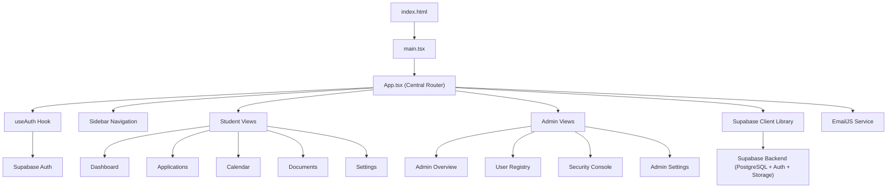
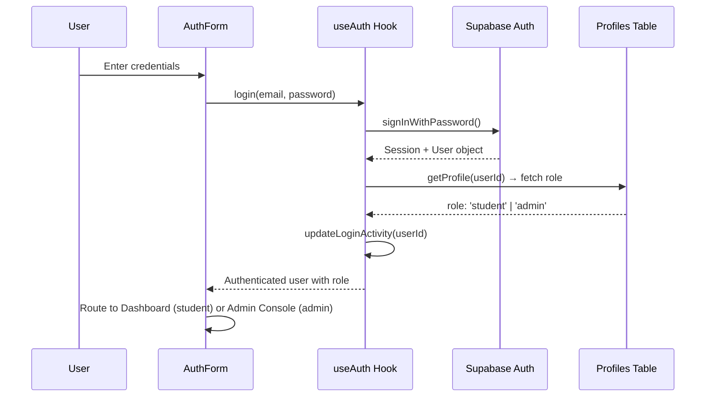
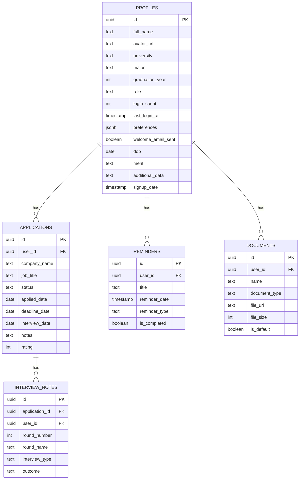

# 📘 InternTrack — Complete Project Documentation

> **An internship application tracking platform** built with React, TypeScript, Vite, Supabase, and TailwindCSS. Features a student portal for managing job applications and an admin console for system-wide oversight.

---

## 🏗️ Architecture Overview

---

## 🚀 Deployment Settings (Render)

| Setting | Value |
|---|---|
| **Service Type** | Static Site |
| **Root Directory** | `app` |
| **Build Command** | `npm install && npm run build` |
| **Publish Directory** | `dist` |
| **Rewrite Rule** | `/*` → `/index.html` (Rewrite) |

### Environment Variables Required on Render

| Variable | Description |
|---|---|
| `VITE_SUPABASE_URL` | Supabase project URL |
| `VITE_SUPABASE_ANON_KEY` | Supabase anonymous API key |
| `VITE_SUPABASE_SERVICE_KEY` | Supabase service role key (admin features) |
| `VITE_EMAILJS_SERVICE_ID` | EmailJS service ID |
| `VITE_EMAILJS_TEMPLATE_ID` | EmailJS template ID |
| `VITE_EMAILJS_PUBLIC_KEY` | EmailJS public key |

---

## 📂 Complete File Map

### Root Level (`d:\Internship\`)

| File | Role |
|---|---|
| `.gitignore` | Git ignore rules |
| `gitcommands.txt` | Quick-reference git commands |
| `app/` | **The entire application lives here** |

---

### `app/` — Project Root

| File | Size | Role |
|---|---|---|
| [index.html](file:///d:/Internship/app/index.html) | 298 B | HTML entry point. Contains the `
` mount point and loads `main.tsx`. |
| [package.json](file:///d:/Internship/app/package.json) | 2.7 KB | Project manifest. Defines dependencies, scripts (`dev`, `build`, `lint`, `preview`). |
| [vite.config.ts](file:///d:/Internship/app/vite.config.ts) | 609 B | Vite bundler config. Sets `base: './'`, `@/` path alias, and manual chunk splitting for framer-motion, recharts, lucide-react, supabase. |
| [tsconfig.app.json](file:///d:/Internship/app/tsconfig.app.json) | ~800 B | TypeScript config for the app source. Targets ES2022, uses bundler module resolution, strict mode, `@/*` path alias. |
| [tsconfig.node.json](file:///d:/Internship/app/tsconfig.node.json) | 653 B | TypeScript config for Node-side files (vite.config.ts). |
| [tsconfig.json](file:///d:/Internship/app/tsconfig.json) | 232 B | Root tsconfig that references `tsconfig.app.json` and `tsconfig.node.json`. |
| [tailwind.config.js](file:///d:/Internship/app/tailwind.config.js) | 3.6 KB | TailwindCSS theme. Defines custom Apple-inspired colors (`apple-blue`, `apple-gray`, `apple-near-black`), fonts, and animations. |
| [postcss.config.js](file:///d:/Internship/app/postcss.config.js) | 80 B | PostCSS config loading TailwindCSS and Autoprefixer. |
| [eslint.config.js](file:///d:/Internship/app/eslint.config.js) | 616 B | ESLint configuration with React hooks and refresh plugins. |
| [components.json](file:///d:/Internship/app/components.json) | 461 B | shadcn/ui component registry config (New York style, TailwindCSS). |
| [.env](file:///d:/Internship/app/.env) | 1.3 KB | Environment variables for Supabase, EmailJS, and app metadata. |
| [DESIGN.md](file:///d:/Internship/app/DESIGN.md) | 20 KB | Design system documentation. |
| [README.md](file:///d:/Internship/app/README.md) | 2.6 KB | Project readme. |
| [info.md](file:///d:/Internship/app/info.md) | 1.4 KB | Additional project info. |

---

### `app/sql/` — Database Schema & Policies

| File | Role |
|---|---|
| `01_users.sql` | Core table setup and initial triggers |
| `02_admin.sql` | Admin RBAC functions |
| `03_applications.sql` | Application entity schema |
| `04_calendar.sql` | Calendar and reminder schema |
| `05_error_logs.sql` | Global error tracking schema |
| `06_profile_columns.sql` | **Profile Schema Fix**: Adds missing settings columns (`dob`, `merit`, `joined_at`) to the cloud DB to fix the invisible data-drop on hard refresh. |
| `DOCUMENT_FIX.SQL` | Storage and bucket RLS override policies |
| `FINAL_FIX.SQL` | Complete drop-and-replace of core tables RLS policies to eliminate infinite recursion |

---

### `app/src/` — Source Code

#### Entry Point

| File | Role |
|---|---|
| [main.tsx](file:///d:/Internship/app/src/main.tsx) | **Application entry point.** Mounts the `<App />` component to the DOM `#root` element. Imports global CSS. |
| [App.tsx](file:///d:/Internship/app/src/App.tsx) | **Central application router and state manager.** Handles: authentication flow, tab-based navigation, application CRUD operations, interview notes, lazy-loading of all page components. Acts as the "brain" connecting all features. |
| [App.css](file:///d:/Internship/app/src/App.css) | Apple-inspired component styles (glassmorphism cards, sidebar styling, custom scrollbars). |
| [index.css](file:///d:/Internship/app/src/index.css) | Global CSS reset, Tailwind directives, CSS custom properties, typography utilities. |

---

#### `app/src/types/` — TypeScript Type Definitions

| File | Role |
|---|---|
| [index.ts](file:///d:/Internship/app/src/types/index.ts) | **All TypeScript interfaces and type aliases.** Defines: `Application`, `InterviewNote`, `Reminder`, `Document`, `Profile`, `UserPreferences`, `ApplicationStats`, `AdminStats`, `UserActivity`, `CompanyStats`, `StatusDistribution`, `PipelineStage`, `AdminRecentApplication`. Also defines union types for `ApplicationStatus`, `EmploymentType`, `InterviewType`, `InterviewOutcome`, `ReminderType`, `DocumentType`, `UserRole`. |

---

#### `app/src/lib/` — Core Libraries

| File | Size | Role |
|---|---|---|
| [supabase.ts](file:///d:/Internship/app/src/lib/supabase.ts) | 19 KB | **The data layer.** Contains ALL Supabase interactions: Auth (signUp, signIn, signOut, getSession), Profile management (getProfile, updateProfile, uploadAvatarImage), Application CRUD, Interview Notes CRUD, Reminders CRUD, Documents & file storage, Stats computation, and **Admin functions** (adminGetAllUsers, adminGetStats, adminGetCompanyDistribution, adminGetStatusDistribution, adminGetPipelineFunnel, adminGetRecentApplications, adminPromoteToAdmin, adminDeleteUser, adminGetUserInternships). Uses two Supabase clients: `supabase` (anon key for regular users) and `supabaseAdmin` (service role key for admin bypass of RLS). |
| [email.ts](file:///d:/Internship/app/src/lib/email.ts) | 1.3 KB | **EmailJS integration.** Sends automated welcome emails to new users upon registration. Includes a 10-second timeout to prevent UI hanging. Marks emails as sent in the database via `markWelcomeEmailSent()`. |
| [utils.ts](file:///d:/Internship/app/src/lib/utils.ts) | 166 B | Utility function `cn()` for merging Tailwind classes using `clsx` + `tailwind-merge`. |

---

#### `app/src/hooks/` — Custom React Hooks

| File | Size | Role |
|---|---|---|
| [useAuth.ts](file:///d:/Internship/app/src/hooks/useAuth.ts) | 3.8 KB | **Authentication state manager.** Tracks current user, loading state, and role. Listens to Supabase `onAuthStateChange` events. Fetches user role from the `profiles` table. Exposes: `user`, `loading`, `login()`, `register()`, `logout()`, `isAuthenticated`, `isAdmin`, `isRootAdmin`. Tracks login activity (count + timestamp). |
| [use-mobile.ts](file:///d:/Internship/app/src/hooks/use-mobile.ts) | 565 B | **Responsive breakpoint hook.** Detects if the viewport is mobile-sized using `matchMedia`. |

---

#### `app/src/components/auth/` — Authentication

| File | Size | Role |
|---|---|---|
| [AuthForm.tsx](file:///d:/Internship/app/src/components/auth/AuthForm.tsx) | 6.9 KB | **Login/Register form.** Animated toggle between login and registration modes. Collects email, password, and full name (for registration). Uses Framer Motion for smooth transitions. |

---

#### `app/src/components/shared/` — Shared UI Components

| File | Size | Role |
|---|---|---|
| [Sidebar.tsx](file:///d:/Internship/app/src/components/shared/Sidebar.tsx) | 9 KB | **Main navigation.** Renders different nav items based on role: Students get Dashboard, Applications, Calendar, Documents, Settings. Admins get Global Analytics, User Registry, Security & Compliance, System Console. Collapsible on desktop, bottom tab-bar on mobile. Shows user name and logout button. |
| [AnimatedBackground.tsx](file:///d:/Internship/app/src/components/shared/AnimatedBackground.tsx) | 2.6 KB | **Decorative animated background.** Renders floating gradient blobs using Framer Motion for visual flair on the auth page. |
| [LoadingView.tsx](file:///d:/Internship/app/src/components/shared/LoadingView.tsx) | 799 B | **Loading spinner.** Displayed as a fallback during lazy-loaded component transitions. |

---

#### `app/src/components/dashboard/` — Student Dashboard

| File | Size | Role |
|---|---|---|
| [Dashboard.tsx](file:///d:/Internship/app/src/components/dashboard/Dashboard.tsx) | 7.4 KB | **Main student dashboard page.** Displays hero welcome, stats cards, status/monthly charts, recent applications, upcoming reminders, and pro tips section. Computes status and monthly distributions from application data. |
| [StatsCard.tsx](file:///d:/Internship/app/src/components/dashboard/StatsCard.tsx) | 2.1 KB | **Individual stat card.** Animated card showing a metric (e.g., "Total Applications: 12") with an icon, color accent, and optional trend indicator. |
| [StatusChart.tsx](file:///d:/Internship/app/src/components/dashboard/StatusChart.tsx) | 3.9 KB | **Pie/donut chart.** Visualizes application status distribution using Recharts. |
| [MonthlyChart.tsx](file:///d:/Internship/app/src/components/dashboard/MonthlyChart.tsx) | 2.2 KB | **Bar chart.** Shows applications submitted per month using Recharts. |
| [RecentApplications.tsx](file:///d:/Internship/app/src/components/dashboard/RecentApplications.tsx) | 4.3 KB | **Recent activity list.** Shows the last 5 applications with company, title, status badge, and date. |
| [UpcomingReminders.tsx](file:///d:/Internship/app/src/components/dashboard/UpcomingReminders.tsx) | 4.3 KB | **Reminder list.** Displays upcoming deadlines, interviews, and follow-ups with date formatting. |

---

#### `app/src/components/applications/` — Application Management

| File | Size | Role |
|---|---|---|
| [ApplicationList.tsx](file:///d:/Internship/app/src/components/applications/ApplicationList.tsx) | 13.5 KB | **Application list/grid view.** Searchable, filterable list of all applications. Supports status dropdown for quick updates, edit, delete, and view. Each card shows company, title, status, dates, and rating. |
| [ApplicationModal.tsx](file:///d:/Internship/app/src/components/applications/ApplicationModal.tsx) | 15.7 KB | **Create/Edit application form.** Multi-field modal for adding or editing application details: company, job title, URL, location, salary, employment type, status, dates, recruiter info, notes, and rating. |
| [ApplicationDetails.tsx](file:///d:/Internship/app/src/components/applications/ApplicationDetails.tsx) | 22.3 KB | **Detailed application view (slide-over panel).** Full detail view of a single application including all fields, status change dropdown, interview notes section with add/delete functionality, recruiter contact info, and action buttons. |

---

#### `app/src/components/calendar/` — Calendar

| File | Size | Role |
|---|---|---|
| [CalendarView.tsx](file:///d:/Internship/app/src/components/calendar/CalendarView.tsx) | 14 KB | **Calendar page.** Monthly calendar view showing application deadlines and interview dates. Highlights days with events. Clicking a day shows event details. |

---

#### `app/src/components/documents/` — Document Management

| File | Size | Role |
|---|---|---|
| [DocumentsView.tsx](file:///d:/Internship/app/src/components/documents/DocumentsView.tsx) | 15.3 KB | **Document upload and management page.** Upload resumes, cover letters, transcripts, portfolios, and certificates to Supabase Storage. Displays file list with type, size, upload date. Supports download and delete. |

---

#### `app/src/components/settings/` — User Settings

| File | Size | Role |
|---|---|---|
| [SettingsView.tsx](file:///d:/Internship/app/src/components/settings/SettingsView.tsx) | 26.8 KB | **Profile and preferences page.** Editable profile fields: name, university, major, graduation year, DOB, merit, additional data. Avatar upload with live preview. Password change. Notification preferences (email, deadline reminders, interview reminders, weekly digest). Theme and appearance settings. |

---

#### `app/src/components/admin/` — Admin Console (4 Pages)

| File | Size | Role |
|---|---|---|
| [AdminOverview.tsx](file:///d:/Internship/app/src/components/admin/AdminOverview.tsx) | 6.1 KB | **Admin Page 1: Global Analytics.** Dashboard showing total students, active applications, recent active users (7-day), and offer rate. Lists the 20 most recent applications across all users with applicant name, company, status, and date. |
| [UserRegistryView.tsx](file:///d:/Internship/app/src/components/admin/UserRegistryView.tsx) | 25.4 KB | **Admin Page 2: User Registry.** Complete student roster with search. Expandable identity modal per user showing: profile info, avatar, login count, last login, joined date, university, major, DOB, merit. Internship drill-down tab listing all their applications. Security tab showing MFA status. Supports user creation (invite new student) and **user deletion with Level-based purge**: Level 1 (remove from project but keep DB records) or Level 2 (full data wipe). |
| [SecurityConsole.tsx](file:///d:/Internship/app/src/components/admin/SecurityConsole.tsx) | 6.1 KB | **Admin Page 3: Security & Compliance.** Project-wide security audit dashboard. Monitors: RLS policy status, MFA enrollment across users, data encryption protocols (AES-256), API key rotation status, storage bucket permissions. Displays compliance score. |
| [AdminSettings.tsx](file:///d:/Internship/app/src/components/admin/AdminSettings.tsx) | 6.8 KB | **Admin Page 4: System Console.** Admin delegation (promote users to admin status). Database maintenance tools. System info display. |

---

#### `app/src/components/ui/` — 53 shadcn/ui Primitives

Low-level, reusable UI building blocks auto-generated by [shadcn/ui](https://ui.shadcn.com/). These wrap Radix UI primitives with Tailwind styling. Key components include:

| Component | Purpose |
|---|---|
| `button.tsx` | Styled button with variants (default, outline, ghost, destructive) |
| `dialog.tsx` | Modal dialog wrapper |
| `input.tsx` | Styled text input |
| `select.tsx` | Dropdown select |
| `card.tsx` | Card container |
| `table.tsx` | Data table |
| `tabs.tsx` | Tab navigation |
| `calendar.tsx` | Date picker calendar |
| `chart.tsx` | Recharts integration wrapper |
| `sidebar.tsx` | Complex sidebar layout system |
| + 43 more | accordion, alert, avatar, badge, breadcrumb, carousel, checkbox, command, context-menu, drawer, dropdown-menu, form, hover-card, label, menubar, navigation-menu, pagination, popover, progress, radio-group, resizable, scroll-area, separator, sheet, skeleton, slider, sonner, spinner, switch, textarea, toggle, tooltip, etc. |

---

### `app/sql/` — Database Scripts

| File | Size | Role |
|---|---|---|
| [MASTER_DB_SETUP.sql](file:///d:/Internship/app/sql/MASTER_DB_SETUP.sql) | 16.2 KB | **Master database schema.** Complete setup script: creates all tables (`profiles`, `applications`, `interview_notes`, `reminders`, `documents`), the `is_admin()` helper function, all RLS policies, triggers for auto-creating profiles on user signup, and storage bucket configurations. Run this once on a fresh Supabase project. |
| [supabase_schema.sql](file:///d:/Internship/app/sql/supabase_schema.sql) | 11.2 KB | Original schema definition (superseded by MASTER_DB_SETUP but kept for reference). |
| [migration.sql](file:///d:/Internship/app/sql/migration.sql) | 2.8 KB | Migration script adding new profile fields (`dob`, `merit`, `additional_data`, `signup_date`). |
| [admin_analytics.sql](file:///d:/Internship/app/sql/admin_analytics.sql) | 4.9 KB | SQL functions for admin analytics: `get_admin_dashboard_stats()`, `get_company_distribution()`, `get_status_distribution()`, `get_pipeline_funnel()`, `get_recent_applications()`. |
| [admin_seed.sql](file:///d:/Internship/app/sql/admin_seed.sql) | 1.1 KB | Seed script for creating the initial admin user profile. |
| [GRANT_ADMIN.sql](file:///d:/Internship/app/sql/GRANT_ADMIN.sql) | 705 B | Quick script to grant admin role to `admin@gmail.com`. |
| [storage_setup.sql](file:///d:/Internship/app/sql/storage_setup.sql) | 2.7 KB | Storage bucket creation and RLS policies for `avatars` and `documents` buckets. |
| [userdetailsinput.sql](file:///d:/Internship/app/sql/userdetailsinput.sql) | 5.5 KB | Extended profile fields and user details schema. |
| [ERRORFIX.SQL](file:///d:/Internship/app/sql/ERRORFIX.SQL) | 3.8 KB | Hotfix script for resolving RLS infinite recursion issues. |
| [FINAL_FIX.SQL](file:///d:/Internship/app/sql/FINAL_FIX.SQL) | 5.5 KB | Final consolidated fix for all database issues encountered during development. |

---

## 🔑 Key Dependencies

| Package | Version | Purpose |
|---|---|---|
| `react` | 19.2.0 | UI framework |
| `react-dom` | 19.2.0 | DOM rendering |
| `typescript` | 5.9.3 | Type safety |
| `vite` | 7.2.4 | Build tool and dev server |
| `@supabase/supabase-js` | 2.103.3 | Backend (Auth, DB, Storage) |
| `framer-motion` | 12.38.0 | Animations and transitions |
| `recharts` | 2.15.4 | Charts (pie, bar, area) |
| `lucide-react` | 0.562.0 | Icon library |
| `tailwindcss` | 3.4.19 | Utility-first CSS |
| `sonner` | 2.0.7 | Toast notifications |
| `@emailjs/browser` | 4.4.1 | Client-side email sending |
| `date-fns` | 4.1.0 | Date formatting utilities |
| `zod` | 4.3.5 | Schema validation |
| `react-hook-form` | 7.70.0 | Form state management |
| `@radix-ui/*` | Various | Accessible UI primitives (20+ packages) |

---

## 🔐 Authentication & Authorization Flow

### Role-Based Access Control

| Role | Access |
|---|---|
| **Student** | Dashboard, Applications, Calendar, Documents, Settings |
| **Admin** | Global Analytics, User Registry, Security Console, System Console |

Admin detection: `user.role === 'admin'` OR `user.email === 'admin@gmail.com'`

---

## 🗄️ Database Schema

---

## 🎨 Design System

- **Theme**: Apple-inspired minimalism with glassmorphism effects
- **Colors**: `apple-blue (#0071e3)`, `apple-gray (#f5f5f7)`, `apple-near-black (#1d1d1f)`
- **Typography**: System font stack with Apple-style tracking
- **Animations**: Framer Motion throughout (page transitions, card reveals, hover effects)
- **Dark Mode**: Full support via Tailwind `dark:` variants
- **Responsive**: Desktop sidebar → Mobile bottom tab bar

---

## 📝 npm Scripts

| Command | Action |
|---|---|
| `npm run dev` | Start Vite dev server (localhost:5173) |
| `npm run build` | TypeScript check + Vite production build → `dist/` |
| `npm run preview` | Preview the production build locally |
| `npm run lint` | Run ESLint |
